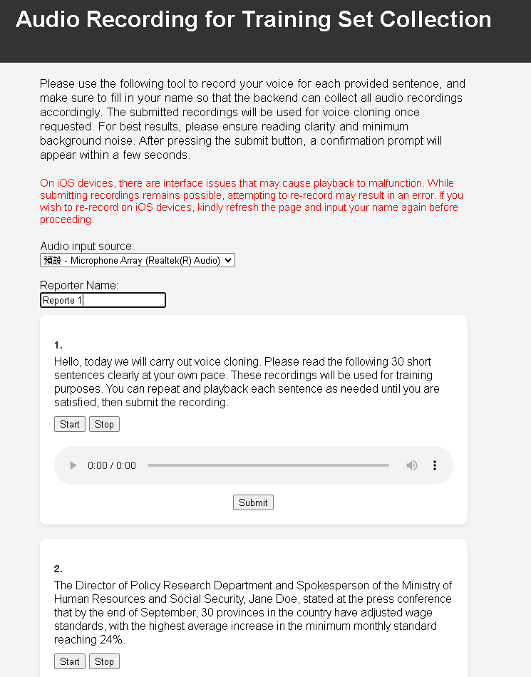
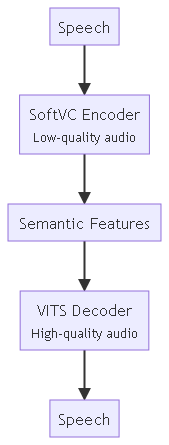
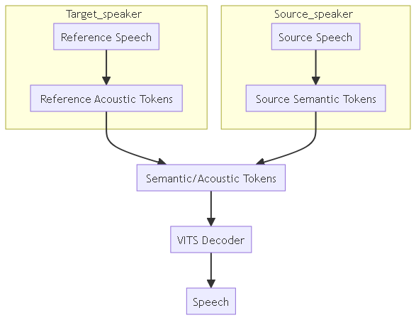
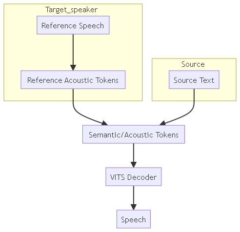

## Table of Content

- [Table of Content](#table-of-content)
- [Overview](#overview)
- [Background](#background)
- [User Manual](#user-manual)
  - [Dataset](#dataset)
- [Training](#training)
  - [Instructions for Linux](#instructions-for-linux)
    - [Installation](#installation)
    - [Training](#training-instructions)
  - [Inference](#inference)
- [Technical Basis](#technical-basis)
  - [Components](#components)
    - [SoVITS: SoftVC VITS](#sovits-softvc-vits)
      - [Training and Voice Characteristics](#training-and-voice-characteristics)
    - [Semantic Token and Timbre Token](#semantic-token-and-timbre-token)
      - [Timbre Leakage](#timbre-leakage)
    - [GPT](#gpt)
  - [GPT-SoVITS Architecture](#gpt-sovits-architecture)

## Overview

This article aims to provide a comprehensive guide to the GPT-SoVITS repository developed by RVC-Boss. It offers detailed installation instructions, advice on dataset collection and training, and commands for running the system on Linux. Additionally, it also delves into the technical principles behind GPT-SoVITS, attempting to explain underlying technologies employed in this open-source project. 

## Background 

The GitHub repository [GPT-SoVITS](https://github.com/RVC-Boss/GPT-SoVITS) by RVC-Boss focuses on few-shot voice cloning and text-to-speech (TTS). Key features include:

1. **Zero-shot TTS**: Instant TTS conversion from a 5-second vocal sample.
2. **Few-shot TTS**: Fine-tuning with 1-minute voice data for improved realism.
3. **Cross-lingual Support**: Works with English, Japanese, and Chinese.
4. **WebUI Tools**: Includes tools for voice separation, training set segmentation, ASR, and text labelling, aiding in model creation.

The repository offers detailed installation instructions and supports multiple environments including Windows, Linux, and macOS. 

## User Manual

### Dataset 

From the author's experiment, it was concluded that a set of short recordings provides the best result rather than long recordings. Roughly 10 minutes of high-quality, clearly spoken speech with minimum background noise is sufficient to generate coherent speech of a speaker. There following web interface was developed using the Azure App service to collect these samples. 


*Figure 1. Dataset collection interface [link](https://voice-training.azurewebsites.net/en).*

## Training 

Training instructions and advice on navigating the officially provided interface can be found here: 
- [Open-source documentation ](https://www.yuque.com/baicaigongchang1145haoyuangong/ib3g1e)
- [Internal documentation](https://docs.google.com/document/d/1exlcbFV-ttJqEfOFYksWqy5gRPDrzoclgPqB_ajt7Bs/edit?usp=sharing)

Generally, the training interface has been designed to run on Windows and Mac machines. However, the aforementioned internal documentation and the following section includes the corresponding commands to run on Linux. This can be highly beneficial for automation. 

### Instructions for Linux

If using Azure, ensure that the security type is set to ‘Standard’.
**Install NVIDIA CUDA Driver**: [Install NVIDIA CUDA Driver](https://learn.microsoft.com/en-us/azure/virtual-machines/linux/n-series-driver-setup)
**Install Miniconda**: [Install Miniconda](https://docs.anaconda.com/free/miniconda/)

#### Installation
Please note that the following clones a *forked* repository 
``` bash
git clone -b 6do https://github.com/Ann-yang00/GPT-SoVITS.git 
cd GPT-SoVITS  
conda create -n GPTSoVits python=3.9  
conda activate GPTSoVits  
bash install.sh
```

**Download pre-trained models**: Download pre-trained models from [GPT-SoVITS Models](https://huggingface.co/lj1995/GPT-SoVITS) and place them in `GPT_SoVITS/pretrained_models`.

*Below should all be executed from the initially cloned GPT-SoVITS directory*
Please refer to the below GUI screen snips for parameter reference

#### Training

**Audio Slicer**
``` bash
"C:\Users\zsy\Desktop\GPT-SoVITS-beta0217\runtime\python.exe" tools/slice_audio.py "C:\Users\zsy\Desktop\edited" "output\slicer_opt" -34 4000 300 10 500 0.9 0.25 3 4
```
The original command above enables multi-thread audio slicing with the last two parameters. Set this to 0 1 such as the following if this is not desired.
``` bash
python tools/slice_audio.py /home/zsy/  
trainingSet/ "output/slicer_opt" -34 4000 300 10 500 0.9 0.25 0 1
```

**ASR**
``` bash
"C:\Users\zsy\Desktop\GPT-SoVITS-beta0217\runtime\python.exe" tools/asr/funasr_asr.py -i "C:\Users\zsy\Desktop\GPT-SoVITS-beta0217\output\slicer_opt" -o "output/asr_opt" -s large -l zh -p float16
```

**One-click formatting**
Please adjust the configurations in the “/GPT_SoVITS/configs/cfig.py” accordingly. 
``` bash
"C:\Users\zsy\Desktop\GPT-SoVITS-beta0217\runtime\python.exe" GPT_SoVITS/prepare_datasets/1-get-text.py  
  
"C:\Users\zsy\Desktop\GPT-SoVITS-beta0217\runtime\python.exe" GPT_SoVITS/prepare_datasets/2-get-hubert-wav32k.py  
  
"C:\Users\zsy\Desktop\GPT-SoVITS-beta0217\runtime\python.exe" GPT_SoVITS/prepare_datasets/3-get-semantic.py
```

**SoVITS training**
*create and edit TEMP/tmp_s2.json as needed*
``` bash
"C:\Users\zsy\Desktop\GPT-SoVITS-beta0217\runtime\python.exe" GPT_SoVITS/s2_train.py --e_name TS
```
Pass the name that you have assigned to the model as in the previous cfig using `--e_name`.

**GPT training**
*create and edit TEMP/tmp_s1.yaml as needed*
``` bash
python '/home/azureuser/GPT-SoVITS/GPT_SoVITS/s1_train.py' --config '/home/azureuser/GPT-SoVITS/GPT_SoVITS/configs/tmp_s1.yaml' --e_name TS
```
Use the --e_name argument same as before to specify a name

### Inference

After testing, it was found that text slicing per 30 character yields the best results for our use case. Please see the aforementioned [forked repository](https://github.com/Ann-yang00/GPT-SoVITS/blob/main/api.py) for this API implementation. Inference can run smoothly on CPU.  

Commands for inference are the following:
*Below should all be executed from the initially cloned GPT-SoVITS directory*

**Start server**
``` bash
python3 api.py -s "trainedModel/LJ-v2/ref.pth" -g "trainedModel/LJ-v2/ref.ckpt" -dr "trainedModel/LJ-v2/ref.wav" -dt "text_in_reference_audio" -dl "zh" -d "cpu"
```
- `-s`: SoVITS model path
- `-g`: GPT model path
- `-dr`: default reference audio path
- `-dt`: default reference audio prompt
- `-dl`: default reference audio language
- `-d`: processing unit

**Inference**
``` bash
curl -X POST -H "Content-Type: application/json" -d '{"text": "This is the text to be sonified. ", "text_language": "zh", "slice": "凑30字一切"}' http://127.0.0.1:9880 -o output.wav
```
- `text`: prompt to sonify
- `-o`: file name of resultant audio

**Change model dynamically**
``` bash
curl -X POST -H "Content-Type: application/json" -d '{"gpt_model_path": "trainedModel/Base/ref.ckpt", "sovits_model_path": "trainedModel/Base/ref.pth"}' http://127.0.0.1:9880/set_model
```

## Technical Basis

The following content attempts to explain the technical principles of GPT-SoVITS based on information in [this video](https://www.bilibili.com/video/BV12g4y1m7Uw/) and the [GitHub repository](https://github.com/RVC-Boss/GPT-SoVITS)If there is any inconsistency in my interpretation, please *prioritise official sources*. 

### Components
#### SoVITS: SoftVC VITS
[Reference GitHub repository](https://github.com/svc-develop-team/so-vits-svc)
SoVITS is a voice conversion system that combines two primary components: SoftVC as the speech encoder to extract speech features from the source audio and VITS, the synthesizer. This system aims to produce high-quality, natural-sounding speech through advanced neural network architectures.


*Figure 2. SoVITS Architecture ([video](https://www.bilibili.com/video/BV12g4y1m7Uw/))*

 **[SoftVC (Speech Encoder):](https://arxiv.org/abs/2111.02392)**
- **Function:** Encodes audio input into a token representation.
- **Description:** SoftVC transforms speech into a sequence of tokens that can be used by the VITS decoder. These tokens capture the essential features of the input audio while being agnostic to the speaker's identity, making it suitable for voice conversion tasks.

**[VITS (Synthesiser):](https://arxiv.org/abs/2106.06103)**    
- **Function:** Decodes tokens into audio.
- **Description:** VITS employs a Conditional Variational Autoencoder (VAE) augmented with normalising flows and adversarial learning to synthesize speech from text. It aims to produce natural-sounding audio that matches the quality of two-stage TTS systems but in a more efficient end-to-end manner.

##### Training and Voice Characteristics

- **Training Process:** The VITS decoder is trained to reproduce the training voice from semantic tokens. The model learns to synthesise speech that closely matches the natural voice quality of the training data.
- **Voice Conversion:** When other voices are encoded using this model, the decoded audio by VITS retains the tonal qualities of the training voice due to the learned characteristics embedded in the decoder weights, effectively achieving voice conversion.

#### Semantic Token and Timbre Token
##### Timbre Leakage 
- **Issue:** If an encoder does not fully remove timbre information from the audio during the encoding process, it may result in the leakage of timbre characteristics into 'semantic tokens'. This means that some aspects of the speaker's voice quality persist in the encoded representation, which can be undesirable in certain applications. 
- **Potential Benefit**: This leakage of timbre can actually be used to guide or influence the timbre of the synthesised audio. 

**HuBERT and Timbre Tokens:**
- **HuBERT (Hidden Unit BERT):** A model designed to encode audio by learning hidden representations from unlabelled speech data. In this context, HuBERT's ability to capture and represent rich audio features is leveraged to encode the timbre information. These timbre tokens are then used to achieve the target speaker's voice characteristics in the synthesis process.

**ContentVC and  Semantic Tokens:**
- **ContentVC (Content Voice Conversion):** A model focused on extracting the semantic content of speech while minimizing the influence of timbre. ContentVC aims to produce a representation that captures the linguistic and prosodic aspects of speech (the "what" is being said) rather than the voice's unique qualities (the "how" it sounds).

#### GPT
[Reference: Soundstorm AR](https://github.com/yangdongchao/SoundStorm/tree/master/soundstorm/s1/AR)
[Reference: Autoregressive MQTTS](https://github.com/innnky/ar-vits/tree/mqvits)

- **Function:** This plays a crucial role by utilising autoregressive (AR) techniques, which is responsible for predicting and generating audio tokens sequentially, where each token generation is conditioned on the previously generated tokens.
- **Use case**: The GPT model in this context is responsible for integrating the 'semantic information' and 'tonal conditioning' into a coherent sequence. This ensures that the final output not only conveys the correct content but also retains the desired tonal characteristics. 

### GPT-SoVITS Architecture 


*Figure 3. GPT-SoVITS Architecture ([video](https://www.bilibili.com/video/BV12g4y1m7Uw/))*

**Target Speaker**:
- **Reference Speech**: This is the speech sample from which we want to clone the voice.
- **Reference Acoustic Tokens**: The reference speech is processed to extract acoustic tokens using HuBERT. These tokens capture the unique characteristics of the source speaker's voice.

**Source Speaker**:
- **Source Speech**: This is the audio sample which contains the content that needs to be converted to the target speaker's voice.
- **Source Semantic Tokens**: The target speech is processed to extract semantic tokens. These tokens represent the linguistic content and meaning of the speech, abstracting away from the specific acoustic properties of the target speaker’s voice.

**Combination of Tokens**:
- **Semantic/Acoustic Tokens**: The reference acoustic tokens from the target speaker and the source semantic tokens are combined to create a comprehensive set of tokens using the trained GPT model. This includes both the content from the source speech and the desired voice characteristics of the target speaker.

**VITS Decoder**:
- **Function**: The VITS decoder translates the combined tokens back into audio, producing high-quality speech that retains the desired characteristics of the target speaker while conveying the content from the source speaker.

**Text-to-speech (TTS)**
In text-to-speech applications, the source speaker block can simply be replace with the text to be generated.

*Figure 4. GPT-SoVITS Architecture for TTS ([video](https://www.bilibili.com/video/BV12g4y1m7Uw/))*

---
Author: Zih-Syuan Yang 
31 May 2024